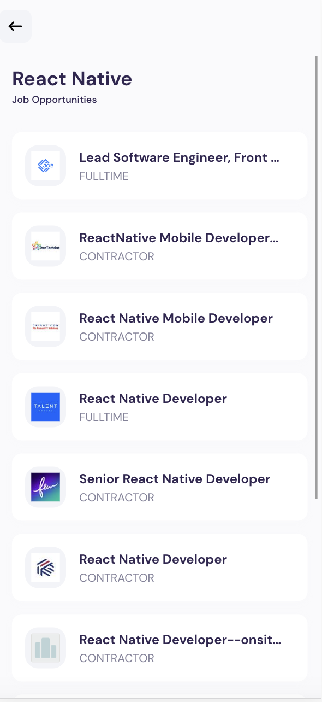

# Expo Router Example

Use [`expo-router`](https://expo.github.io/router) to build native navigation using files in the `app/` directory.

## Description


Simple Job search application with search and Job description page using the Rapid Jsearch API for data.
implemented with React native with Expo cli and Router


## 🚀 How to use

```sh
npx create-expo-app -e with-router
```

## 📝 Notes

- [Expo Router: Docs](https://expo.github.io/router)
- [Expo Router: Repo](https://github.com/expo/router)

## Screenshots
<p float="left">
  
   
  
  
</p>
-- - - - -- - 

## Note 
<i>In this Project, Rapid Api key used is on basic plan if you can't see results on demo app then requests are exceeded limit and renewed each month<i>
